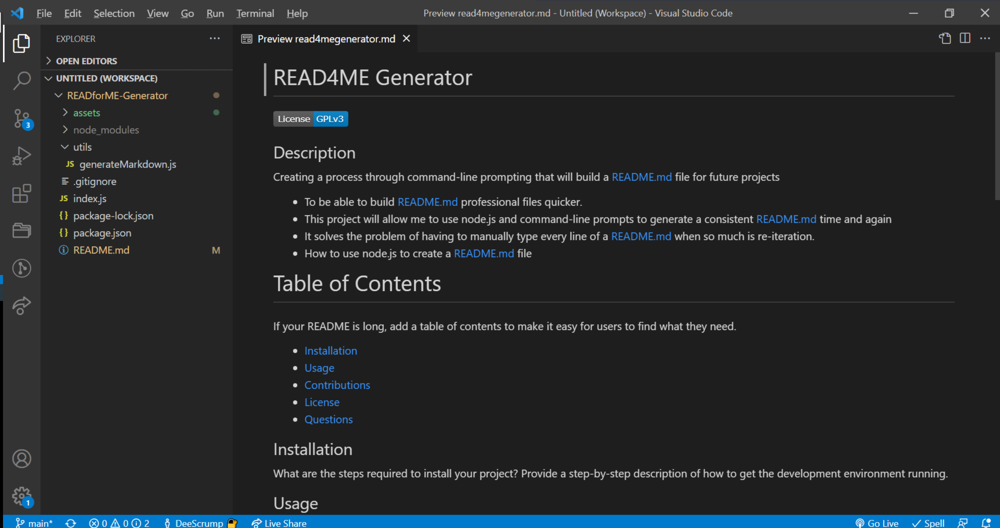
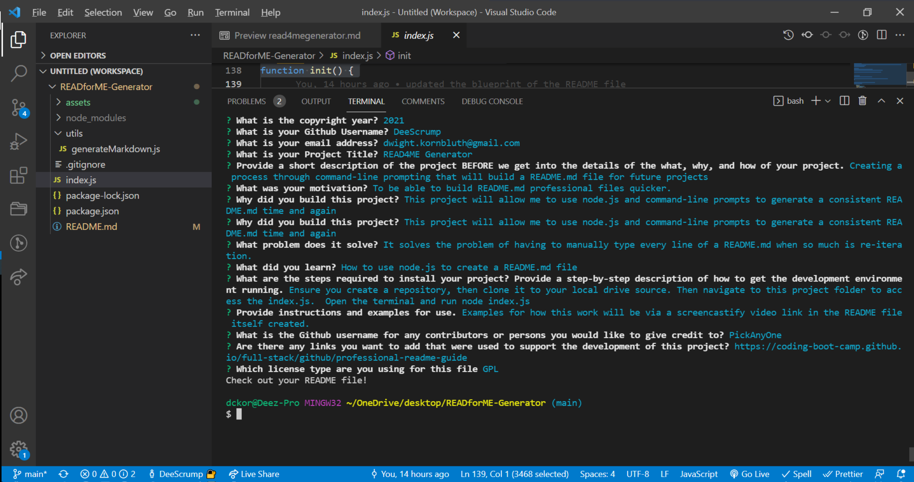

# READ4ME Generator

## Description
Creating a process through command-line prompting that will build a README.md file for future projects
- To be able to build README.md professional files quicker.
- This project will allow me to use node.js and command-line prompts to generate a consistent README.md time and again
- It solves the problem of having to manually type every line of a README.md when so much is re-iteration.
- How to use node.js to create a README.md file

# Table of Contents
If your README is long, add a table of contents to make it easy for users to find what they need.
- [Installation](#installation)
- [Usage](#usage)
- [Contributions](#contributions)
- [License](#license)
- [Questions](#questions)

## Installation
What are the steps required to install your project? Provide a step-by-step description of how to get the development environment running.

## Usage
Examples for how this work will be via a screencastify video link in the README file itself created.

Please see screenshots attached
- 
- 

    
## Contributions
The following persons assisted with this project.  If left blank, there were no other contributors.
- PickAnyOne
- https://coding-boot-camp.github.io/full-stack/github/professional-readme-guide

## License
© <2021> Dwight C Kornbluth II

      This program is free software: you can redistribute it and/or modify
      it under the terms of the GNU General Public License as published by
      the Free Software Foundation, either version 3 of the License, or
      (at your option) any later version.
  
      This program is distributed in the hope that it will be useful,
      but WITHOUT ANY WARRANTY; without even the implied warranty of
      MERCHANTABILITY or FITNESS FOR A PARTICULAR PURPOSE.  See the
      GNU General Public License for more details.
  
      You should have received a copy of the GNU General Public License
      along with this program.  If not, see <https://www.gnu.org/licenses/>.
      

https://www.gnu.org/licenses/gpl-3.0

## Questions
- https://github.com/DeeScrump

- If any questions, please direct them directly to me at dwight.kornbluth@gmail.com

- Deployed Website: https://deescrump.github.io/READforME-Generator/
